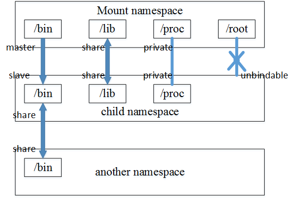
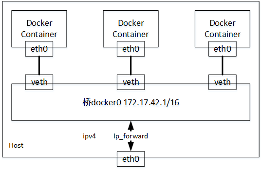

# Docker核心原理

@(Docker)


[TOC]

基调：Docker通过namespace实现资源隔离，通过cgroups实现资源限制，通过写时复制机制（copy-on-write）实现高效的文件操作。

## namespace资源隔离
|namespace|系统调用参数|隔离内容|
|--|--|--|
|UTS|CLONE_NEWUTS|主机名与域名|
|IPC|CLONE_NEWIPC|信号量、消息队列和共享内存|
|PID|CLONE_NEWPID|进程编号|
|Network|CLONE_NEWNET|网络设备、网络栈、端口等|
|Mount|CLONE_NEWNS|挂载点（文件系统）|
|User|CLONE_NEWUSER|用户和用户组|

### 4种操作namespace API的方式
* 通过clone()在创建新进程时的同时创建namespace：指定参数flags
int clone(int (*child_func)(void *), void *child_stack, int flags, void *args);
* 查看/proc/[pid]/ns文件
* 通过setns()加入一个已经存在的namespace
int setns(int fd, int nstype);
* 通过unshare()在原先进程上进行namespace隔离，*目前docker还未使用此调用*
int unshare(int flags);

### UTS namespace
通过代码来感受UTS隔离。
``` cpp
#define _GNU_SOURCE
#include <sys/types.h>
#include <sys/wait.h>
#include <stdio.h>
#include <sched.h>
#include <signal.h>
#include <unistd.h>

#define STACK_SIZE (1024 * 1024)

static char child_stack[STACK_SIZE];
char* const child_args[] = {
    "/bin/bash",
    NULL
};

int child_main(void* args)
{
    printf("在子进程中！\n");
    sethostname("NewNamespace", 12);
    execv(child_args[0], child_args);
    return 1;
}

int main()
{
    printf("程序开始：\n");
    int child_pid = clone(child_main, child_stack + STACK_SIZE,
            CLONE_NEWUTS | SIGCHLD, NULL);
    waitpid(child_pid, NULL, 0);
    printf("已退出\n");
    return 0;
}
```

执行效果
``` bash
[root@localhost home]# ./test_uts.o 
程序开始：
在子进程中！
[root@NewNamespace home]# exit
exit
已退出
```

### IPC namespace
IPC资源包括常见的信号量、消息队列和共享内存。

在UTS namespace的代码上增加CLONE_NEWIPC，演示如下：
1. 先创建一消息队列
``` bash
[root@localhost home]# ipcmk -Q
Message queue id: 0
[root@localhost home]# ipcs -q

------ Message Queues --------
key        msqid      owner      perms      used-bytes   messages    
0xf55619a6 0          root       644        0            0 
```

2. 编译 & 执行
``` bash
[root@localhost home]# gcc -Wall test_uts.c -o test_uts.o
[root@localhost home]# ./test_uts.o 
程序开始：
在子进程中！
[root@NewNamespace home]# ipcs -q

------ Message Queues --------
key        msqid      owner      perms      used-bytes   messages    

[root@NewNamespace home]# exit
exit
已退出
[root@localhost home]# ipcs -q

------ Message Queues --------
key        msqid      owner      perms      used-bytes   messages    
0xf55619a6 0          root       644        0            0  
```

可以看出在新namespace中看不到之前创建的消息队列，退出后能看到，隔离效果很明显。

### PID namespace

对进行PID重新标号，即两个不同namespace下的进程可以有相同的PID。每个PID namespace都有自己的计数程序。内核为所有的PID namespace维护了一个树状结构，最顶层的是系统初始时创建的，被称为root namespace。它创建的新PID namespace被称为child namespace（树的子节点），而原先的PID namespace就是新创建的PID namespace的parent namespace（树的父节点）。通过这种方式，不同的PID namespace会形成一个层级体系。所属的父节点可以看到子节点中的进程，并可以通过信号等方式对子节点中的进程产生影响。反过来，子节点却不能看到父节点PID namespace中的任何内容。

在UTS namespace的代码上增加CLONE_NEWPID，演示如下：
``` bash
root@ubuntu:~# echo $$
1254
root@ubuntu:~# gcc -Wall test_namespace.c -lcap -o test_namespace 
root@ubuntu:~# ./test_namespace 
nobody@NewNamespace:~$ echo $$
1
```

**在 ubuntu 14.04 上测试，在child namespace中ps a看到的parent namespace的PID，需要挂载/proc文件系统**

### mount namespace

通过隔离文件系统挂载点对隔离文件系统提供支持，*它是历史上第一个Linux namespace，flag比较特殊CLONE_NEWNS*。

挂载对象（mount object）之间的关系包括共享关系和从属关系。

* 共享关系: 一个挂载对象中的挂载事件会传播到另一个挂载对象，反之亦然。
* 从属关系：一个挂载对象中的挂载事件会传播到另一个挂载对象，但是反之不行；在这种关系中，从属对象是事件的接收者。

一个挂载状态可能为以下几种：
* 共享挂载（shared）
* 从属挂载（slave）
* 共享/从属挂载（shared and slave）
* 私有挂载（private）
* 不可绑定挂载（unbindable）



### network namespace

提供关于网络资源的隔离，包括网络设备、IPv4和IPv6协议栈、IP路由表、防火墙、/proc/net目录、/sys/class/net目录、套接字（socket）等。一个物理的网络设备最多存在于一个network namespace中，可以通过创建veth pair（虚拟网络设备对：有两端，类似管道，如果数据从一端传入另一端也能接收到，反之亦然）在不同的network namespace间创建通道，以达到通信目的。

在建立veth pair之前，新旧namespace通过pipe（管道）通信。



flag: CLONE_NEWNET

### user namespace

隔离安全相关的标识符（identifiers）和属性（attributes），包括用户ID、用户组ID、root目录、key（指密钥）以及特殊权限。

flag: CLONE_NEWUSER，新增如下代码

``` cpp
void set_uid_map(pid_t pid, int inside_id, int outside_id, int length)
{
    char path[256];
    sprintf(path, "/proc/%d/uid_map", getpid());
    FILE* uid_map = fopen(path, "w");
    fprintf(uid_map, "%d %d %d", inside_id, outside_id, length);
    fclose(uid_map);
}

void set_gid_map(pid_t pid, int inside_id, int outside_id, int length)
{
    char path[256];
    sprintf(path, "/proc/%d/gid_map", getpid());
    FILE* gid_map = fopen(path, "w");
    fprintf(gid_map, "%d %d %d", inside_id, outside_id, length);
    fclose(gid_map);
}

int child_main(void* args)
{
    printf("在子进程中！\n");
    sethostname("NewNamespace", 12);
    cap_t caps;
    set_uid_map(getpid(), 0, 1000, 1);
    set_gid_map(getpid(), 0, 1000, 1);
    printf("eUID = %ld; eGID = %ld; ",
            (long) geteuid,  (long) getegid());
    caps = cap_get_proc();
    printf("capabilities: %s\n", cap_to_text(caps, NULL));
    execv(child_args[0], child_args);
    return 1;
}
```

展示结果如下：

``` bash
root@ubuntu:~# ./test_namespace 
程序开始：
在子进程中！
eUID = 4196720; eGID = 65534; capabilities: = cap_chown,cap_dac_override,cap_dac_read_search,cap_fowner,cap_fsetid,cap_kill,cap_setgid,cap_setuid,cap_setpcap,cap_linux_immutable,cap_net_bind_service,cap_net_broadcast,cap_net_admin,cap_net_raw,cap_ipc_lock,cap_ipc_owner,cap_sys_module,cap_sys_rawio,cap_sys_chroot,cap_sys_ptrace,cap_sys_pacct,cap_sys_admin,cap_sys_boot,cap_sys_nice,cap_sys_resource,cap_sys_time,cap_sys_tty_config,cap_mknod,cap_lease,cap_audit_write,cap_audit_control,cap_setfcap,cap_mac_override,cap_mac_admin,cap_syslog,cap_wake_alarm,cap_block_suspend,37+ep
```